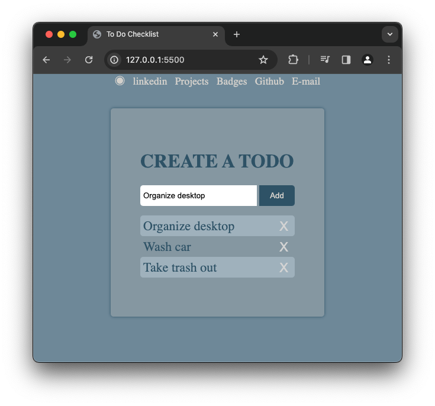

Introducing our innovative Todo app built with HTML, CSS, and JavaScript! But here's the secret sauce: your tasks magically persist even after refreshing the page, thanks to our advanced local storage technology. Say goodbye to lost progress and hello to uninterrupted productivity!

HOW TO RUN 
------------------------------------
* To get started, navigate to the Todo-list repository on GitHub and download the files. Then, open the folder in Visual Studio Code and launch the live server extension. This action  will automatically open the project in your default web browser.

TECHNOLOGY STACK USED
------------------------------------
* HTML
* CSS
* JavaScript

